# SEALMit - System Architecture

## 1. Overview

SEALMit is an Engineering Lifecycle Management (ELM) system built with a modern, layered architecture that separates concerns and enables flexible deployment options. The system uses a **client-server architecture** with a **React frontend**, **FastAPI backend**, and **Git-based XML storage**.

### 1.1 Key Architectural Principles

- **Separation of Concerns**: Clear boundaries between presentation, business logic, and data layers
- **API-First Design**: RESTful API enables multiple client types (web, desktop, future mobile)
- **Version Control Integration**: Git provides built-in traceability and audit trail
- **Stateless Backend**: API is stateless, enabling horizontal scaling
- **Flexible Deployment**: Same codebase supports web and desktop deployments

---

## 2. System Architecture

### 2.1 High-Level Architecture

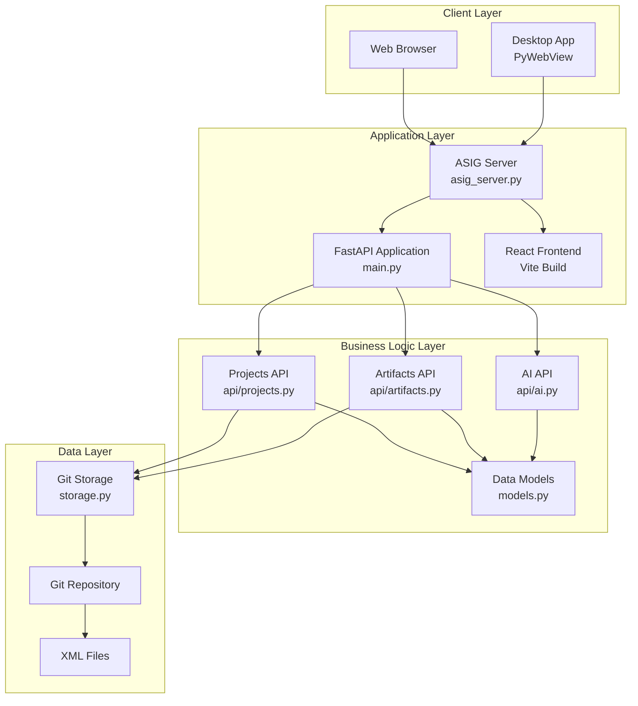

### 2.2 Deployment Models

#### Web Application (ASIG Server)

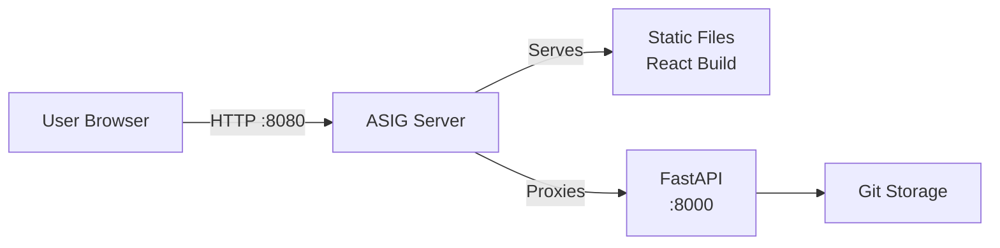

**Characteristics**:
- Centralized deployment
- Multiple users can access same instance
- Requires server infrastructure
- Port 8080 for ASIG, port 8000 for API

#### Desktop Application

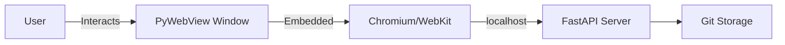

**Characteristics**:
- Standalone deployment
- Single user per instance
- No server infrastructure needed
- All components run locally

---

## 3. Component Architecture

### 3.1 Client Layer

#### Web Browser
- **Technology**: Any modern browser (Chrome, Firefox, Safari, Edge)
- **Responsibility**: Render React application, handle user interactions
- **Communication**: HTTP/HTTPS to ASIG server

#### Desktop Application (PyWebView)
- **Technology**: PyWebView 6.1+
- **Responsibility**: Native window wrapper for web application
- **Communication**: localhost HTTP to embedded FastAPI server
- **Platform Support**: Windows, macOS, Linux

### 3.2 Application Layer

#### ASIG Server (`asig_server.py`)
- **Technology**: FastAPI + Static File Serving
- **Responsibility**: 
  - Serve React frontend static files
  - Proxy API requests to FastAPI backend
  - Coordinate web deployment
- **Port**: 8080 (default)

#### FastAPI Application (`main.py`)
- **Technology**: FastAPI, Uvicorn
- **Responsibility**:
  - Define API routes and endpoints
  - Handle CORS configuration
  - Coordinate API modules
- **Port**: 8000 (default)

#### React Frontend
- **Technology**: React 19, Vite, React Router
- **Responsibility**:
  - User interface rendering
  - Client-side routing
  - API communication
  - State management
- **Build Output**: Static files in `dist/` directory

### 3.3 Business Logic Layer

#### Projects API (`api/projects.py`)
- **Responsibility**: Project lifecycle management
- **Endpoints**:
  - `GET /api/projects/` - List all projects
  - `POST /api/projects/` - Create new project
  - `GET /api/projects/{name}` - Get project state

#### Artifacts API (`api/artifacts.py`)
- **Responsibility**: Artifact and trace management
- **Endpoints**:
  - `POST /api/artifacts/{project}/artifacts` - Create artifact
  - `PUT /api/artifacts/{project}/artifacts/{id}` - Update artifact
  - `DELETE /api/artifacts/{project}/artifacts/{id}` - Delete artifact
  - `POST /api/artifacts/{project}/traces` - Create trace
  - `POST /api/artifacts/{project}/commit` - Commit changes

#### AI API (`api/ai.py`)
- **Responsibility**: AI assistant integration
- **Endpoints**:
  - `POST /api/ai/chat` - Chat with AI assistant
- **Status**: Placeholder implementation, Strands Agents integration planned

#### Data Models (`models.py`)
- **Responsibility**: Define data structures and validation
- **Components**:
  - Enumerations (TraceType, ArtifactType, VerificationMethod)
  - Base models (BaseArtifact, Trace, ProjectConfig, ProjectState)
  - Specialized artifacts (Requirement, RiskHazard, RiskCause, VerificationActivity)

### 3.4 Data Layer

#### Git Storage (`storage.py`)
- **Responsibility**: Persistence and version control
- **Key Operations**:
  - Initialize Git repository
  - Save draft changes (XML serialization)
  - Load project state (XML deserialization)
  - Commit changes to Git
  - Retrieve history
  - Checkout previous states

#### Git Repository
- **Technology**: Git (via GitPython)
- **Structure**: One repository per project
- **Location**: `projects_data/{project_name}/`

#### XML Files
- **Format**: UTF-8 encoded XML
- **Files**:
  - `project.xml` - Project configuration
  - `traces.xml` - Trace relationships
  - `artifacts/{uuid}.xml` - Individual artifacts

---

## 4. Data Architecture

### 4.1 Data Model

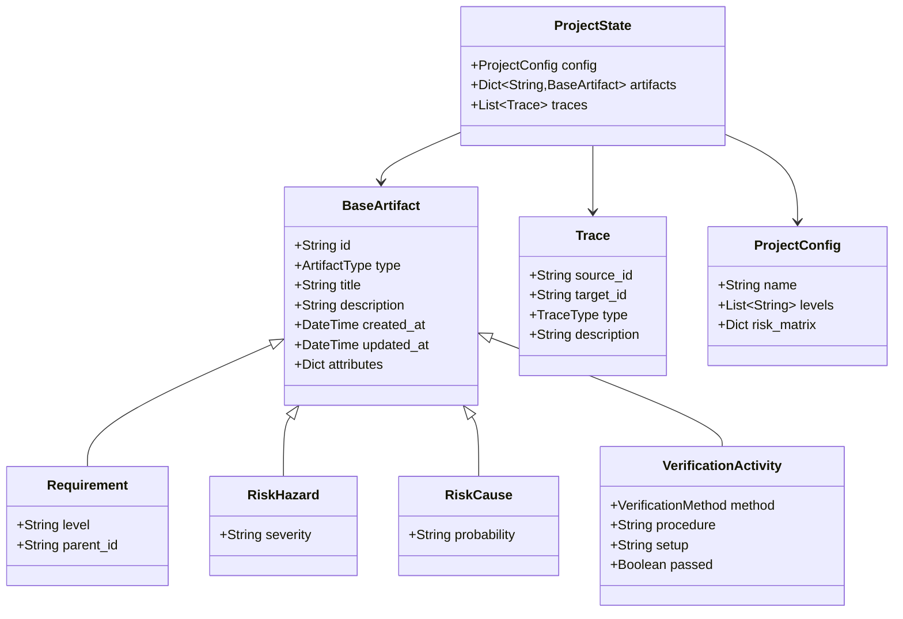

### 4.2 Traceability Model

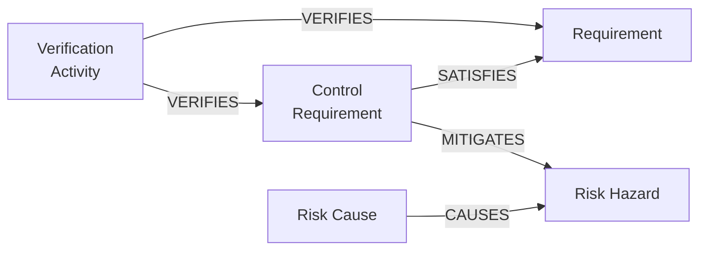

**Trace Types**:
- **SATISFIES**: Design/implementation satisfies a requirement
- **VERIFIES**: Verification activity verifies a requirement or design
- **MITIGATES**: Control mitigates a risk hazard
- **CAUSES**: Cause leads to a hazard

### 4.4 Advanced Traceability Model

#### Complex Risk Traceability

The system supports flexible risk traceability with multiple relationship patterns:

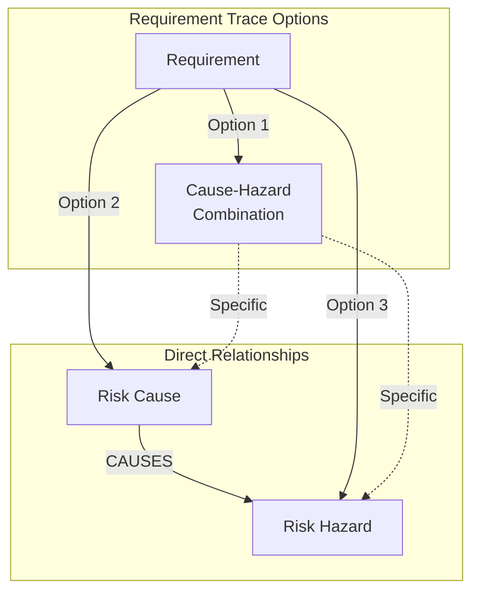

**Trace Patterns**:
1. **Requirement → Cause-Hazard Combination**: Requirement addresses specific cause-hazard pair
2. **Requirement → Cause**: Requirement applies to all hazards linked to that cause
3. **Requirement → Hazard**: Requirement applies to all cause-hazard combinations with that hazard

**Transitive Resolution**: System automatically resolves indirect relationships:
- If Req traces to Cause, and Cause CAUSES Haz1, Haz2 → Req implicitly addresses Haz1 and Haz2
- If Req traces to Hazard, and Cause1, Cause2 CAUSE Hazard → Req implicitly addresses both causes

#### Partial Verification Model

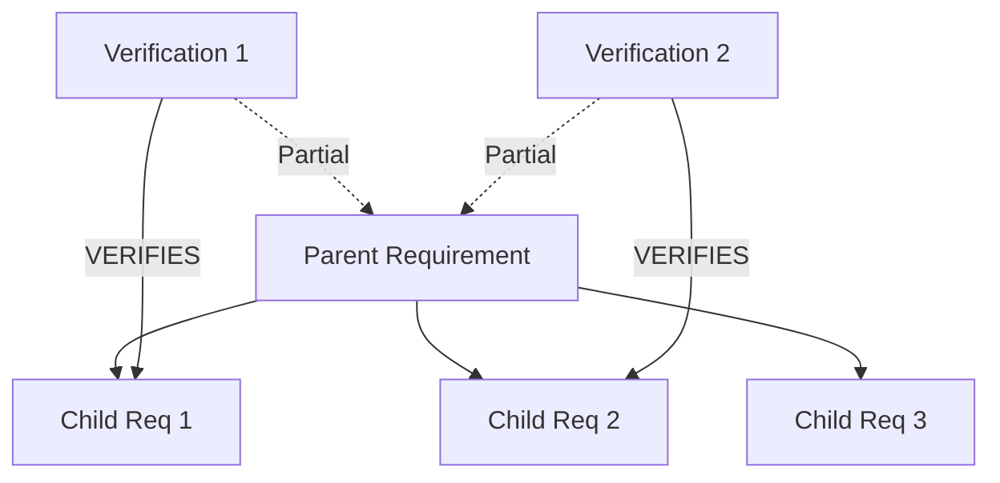

**Verification Propagation**:
- Verification of child requirement provides **partial verification** of parent
- Verification coverage calculated as: `verified_children / total_children`
- Parent is fully verified only when all children are verified

### 4.3 Storage Strategy

#### File Organization

```
projects_data/
└── {project_name}/
    ├── .git/                    # Git repository
    ├── project.xml              # Project configuration
    ├── traces.xml               # All trace relationships
    ├── artifacts/               # Artifact storage
    │   ├── {uuid-1}.xml
    │   ├── {uuid-2}.xml
    │   └── ...
    └── README.md                # Auto-generated
```

#### XML Schema Examples

**Project Configuration** (`project.xml`):
```xml
<?xml version="1.0" encoding="utf-8"?>
<ProjectConfig>
  <Name>My Project</Name>
  <Levels>
    <Level>User</Level>
    <Level>System</Level>
    <Level>Performance</Level>
  </Levels>
</ProjectConfig>
```

**Trace Relationships** (`traces.xml`):
```xml
<?xml version="1.0" encoding="utf-8"?>
<Traces>
  <Trace>
    <SourceID>uuid-1</SourceID>
    <TargetID>uuid-2</TargetID>
    <Type>verifies</Type>
    <Description>Test verifies requirement</Description>
  </Trace>
</Traces>
```

**Artifact** (`artifacts/{uuid}.xml`):
```xml
<?xml version="1.0" encoding="utf-8"?>
<Artifact>
  <ID>uuid</ID>
  <Type>requirement</Type>
  <Title>System shall respond within 2 seconds</Title>
  <Description>Performance requirement</Description>
  <Level>Performance</Level>
  <ParentID>parent-uuid</ParentID>
</Artifact>
```

---

## 5. Technology Stack

### 5.1 Backend Technologies

| Technology | Version | Purpose | Rationale |
|------------|---------|---------|-----------|
| **Python** | ≥3.11 | Backend language | Modern type hints, performance, ecosystem |
| **FastAPI** | ≥0.122.0 | Web framework | Fast, automatic API docs, async support |
| **Pydantic** | ≥2.12.5 | Data validation | Type-safe models, automatic validation |
| **GitPython** | ≥3.1.45 | Git integration | Mature, well-maintained Git library |
| **Uvicorn** | ≥0.38.0 | ASGI server | High-performance async server |
| **PyWebView** | ≥6.1 | Desktop wrapper | Cross-platform native windows |
| **Strands Agents** | ≥1.18.0 | AI integration | AI assistant framework |
| **uv** | Latest | Package manager | Fast, modern dependency management |
| **Ruff** | Latest | Linter/formatter | Extremely fast, comprehensive |
| **MyPy** | Latest | Type checking | Static type safety |

### 5.2 Frontend Technologies

| Technology | Version | Purpose | Rationale |
|------------|---------|---------|-----------|
| **React** | ^19.2.0 | UI framework | Modern, component-based, large ecosystem |
| **React Router** | ^7.9.6 | Routing | Standard React routing solution |
| **Vite** | ^7.2.4 | Build tool | Fast dev server, optimized builds |
| **ESLint** | ^9.39.1 | Linting | Code quality, consistency |

### 5.3 Storage Technologies

| Technology | Purpose | Rationale |
|------------|---------|-----------|
| **Git** | Version control | Industry standard, full history, branching |
| **XML** | Data format | Human-readable, version control friendly, widely supported |

### 5.4 Multi-User and Collaboration Technologies

| Technology | Version | Purpose | Rationale |
### 6.1 RESTful Design

The API follows REST principles:

- **Resource-based URLs**: `/api/projects/{name}/artifacts/{id}`
- **HTTP methods**: GET (read), POST (create), PUT (update), DELETE (delete)
- **JSON payloads**: Request and response bodies use JSON
- **Stateless**: Each request contains all necessary information
- **Standard status codes**: 200 (OK), 201 (Created), 404 (Not Found), etc.

### 6.2 API Layers

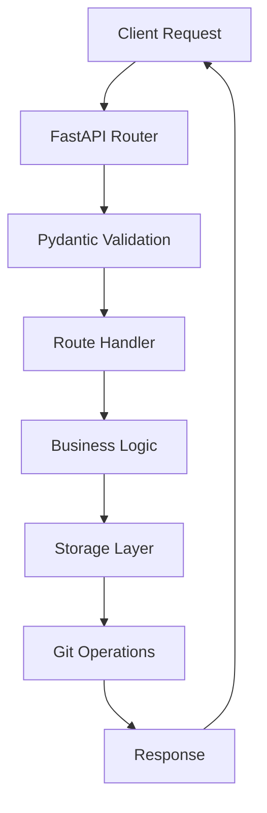

### 6.3 Error Handling

- **Validation Errors**: Pydantic automatically validates request bodies
- **Not Found**: Returns 404 for missing resources
- **Server Errors**: Returns 500 with error details (development mode)
- **CORS**: Configured to allow frontend origin

---

## 7. Integration Points

### 7.1 Frontend-Backend Integration

**Communication**: HTTP/JSON over REST API

**Pattern**:
1. Frontend makes API request (fetch/axios)
2. Backend validates request
3. Backend processes and returns JSON response
4. Frontend updates UI based on response

**Example Flow** (Create Requirement):
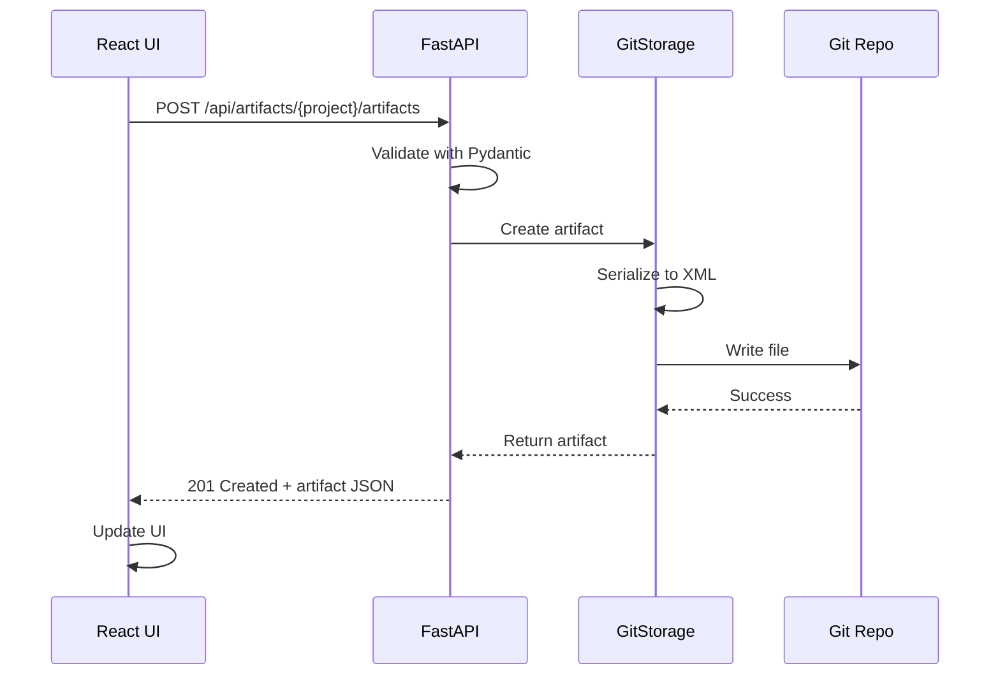

### 7.2 AI Integration

**Current**: Placeholder implementation  
**Planned**: Full Strands Agents orchestrator with worker agents

#### AI Orchestrator Architecture

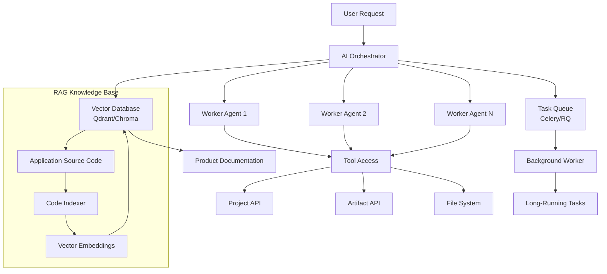

**Components**:
- **Orchestrator**: Manages worker agents, coordinates complex tasks
- **Worker Agents**: Spawned for parallel execution of subtasks
- **Task Queue**: Handles background and long-running tasks
- **Vector Database**: Provides documentation AND source code context to AI
- **Tool Access**: Workers can call API endpoints and perform actions
- **RAG Knowledge Base**: Indexed application source code for code-aware assistance

**Features**:
- Parallel tool execution across multiple workers
- Long-running background tasks with progress tracking
- Stop/edit/continue task management
- File upload analysis and batch processing
- Full UI state awareness
- Configurable LLM API endpoints
- **RAG-based source code retrieval for troubleshooting**
- **Code-aware assistance for application usage questions**

#### RAG Knowledge Base Architecture

**Source Code Indexing Pipeline**:

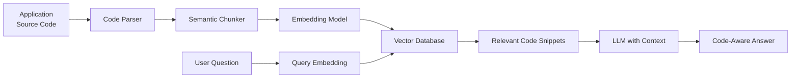

**Indexed Content**:
- **Backend Code**: Python files (models, API endpoints, storage, utilities)
- **Frontend Code**: React components, hooks, utilities
- **Configuration**: pyproject.toml, package.json, vite.config.js
- **Documentation**: README, inline comments, docstrings

**Chunking Strategy**:
- **Function-level**: Each function/method as a chunk
- **Class-level**: Each class with its methods
- **Module-level**: File-level context for imports and structure
- **Metadata**: Include file path, line numbers, dependencies

**Use Cases**:
1. **Usage Questions**: "How do I create a new requirement?"
   - AI retrieves relevant API endpoint code and frontend component
   - Provides step-by-step guidance based on actual implementation

2. **Troubleshooting**: "Why is my commit failing?"
   - AI retrieves commit validation code
   - Explains error conditions and resolution steps

3. **Feature Discovery**: "What verification methods are supported?"
   - AI retrieves VerificationMethod enum and related code
   - Lists all supported methods with examples

4. **Code Understanding**: "How does conflict resolution work?"
   - AI retrieves conflict detection algorithm
   - Explains three-way merge implementation

**Vector Search Configuration**:
```python
# Example configuration
vector_db_config = {
    "collection_name": "sealmit_source_code",
    "embedding_model": "text-embedding-ada-002",  # or open-source alternative
    "chunk_size": 500,  # tokens per chunk
    "chunk_overlap": 50,  # overlap for context
    "metadata_fields": ["file_path", "language", "type", "line_range"]
}
```

### 7.3 Export Architecture

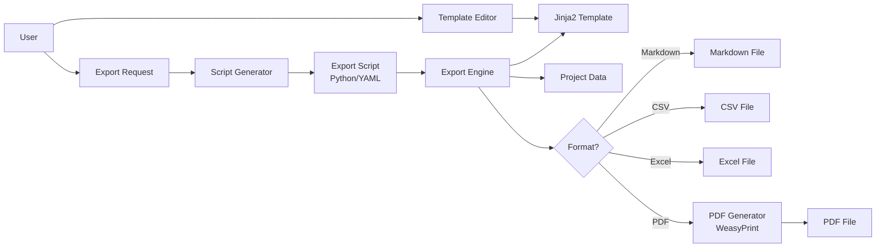

**Export Script Format** (YAML):
```yaml
name: "Requirements Report"
format: "pdf"
template: "requirements_template.md.j2"
filters:
  artifact_types: ["requirement"]
  levels: ["User", "System"]
variables:
  project_name: "{{ project.config.name }}"
  date: "{{ now() }}"
```

**Features**:
- User-defined templates with Jinja2 syntax
- Repeatable export scripts (saved and versioned)
- Multiple output formats (MD, CSV, XLS, PDF)
- Template variables and conditional logic
- Markdown preview with live rendering

### 7.4 User Management Architecture

#### OAuth Flow

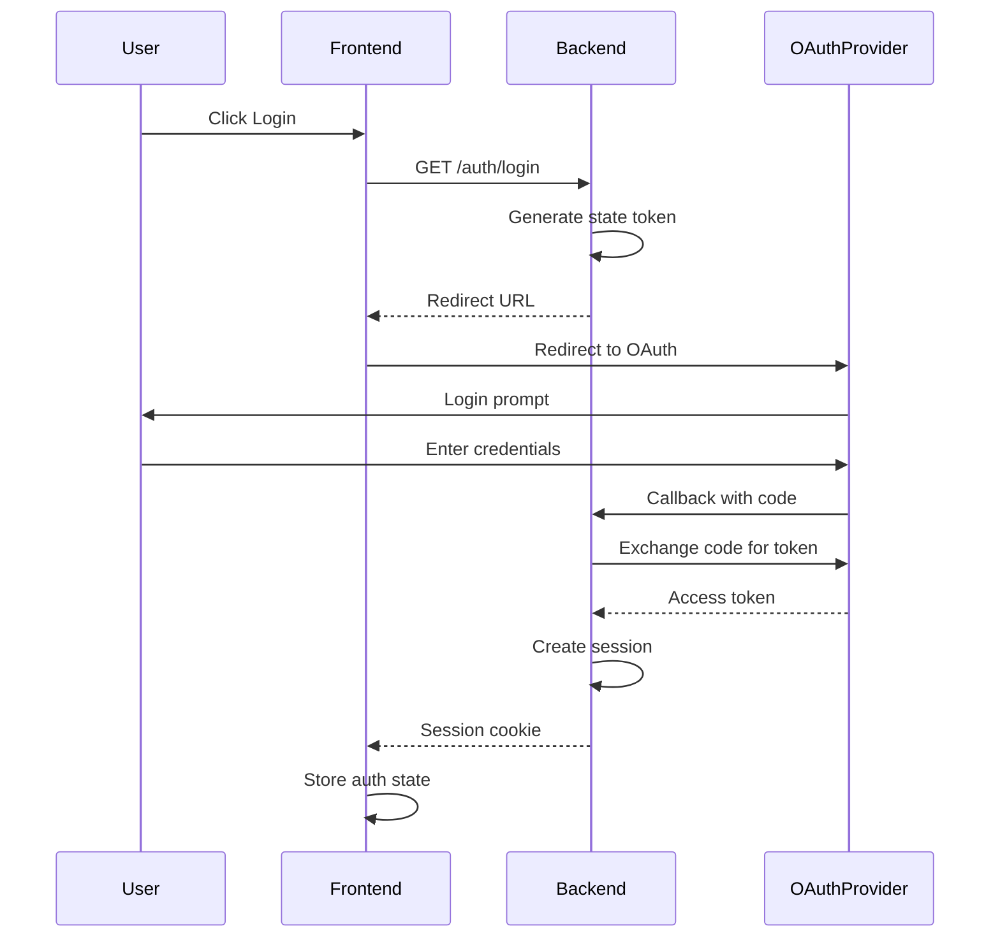

**Configuration** (per organization):
```json
{
  "client_id": "org-client-id",
  "client_secret": "org-client-secret",
  "oauth_config_url": "https://oauth.example.com/.well-known/openid-configuration",
  "scopes": ["openid", "profile", "email"]
}
```

**Session Management**:
- JWT tokens for stateless authentication
- Configurable session timeout
- Secure HTTP-only cookies
- CSRF protection

---

## 8. Security Architecture

### 8.1 Current Security Measures

- **Input Validation**: Pydantic validates all API inputs
- **CORS Configuration**: Restricts cross-origin requests
- **File System Isolation**: Projects stored in dedicated directory
- **Git Integrity**: Git ensures data integrity

### 8.2 Planned Security Features

- **Authentication**: OAuth 2.0 integration (HIGH PRIORITY)
- **Authorization**: Role-based access control (RBAC)
- **HTTPS**: TLS encryption for web deployments (HIGH PRIORITY)
- **Session Security**: Secure tokens, HTTP-only cookies, CSRF protection
- **API Keys**: For programmatic access (future)
- **Audit Logging**: Track all modifications with user attribution

### 8.3 Multi-User Security

**Per-User Draft Isolation**:
- Each user's draft state stored separately
- User attribution for all commits
- Conflict detection prevents overwriting others' work

**Access Control** (future):
- Project-level permissions
- Role-based access (Admin, Editor, Viewer)
- Organization-level user management

---

## 9. Scalability Considerations

### 9.1 Current Architecture

- **Single-instance**: Designed for single user or small team
- **File-based storage**: Git repository per project
- **Stateless API**: Enables horizontal scaling if needed

### 9.2 Multi-User Architecture

#### Conflict Detection and Resolution

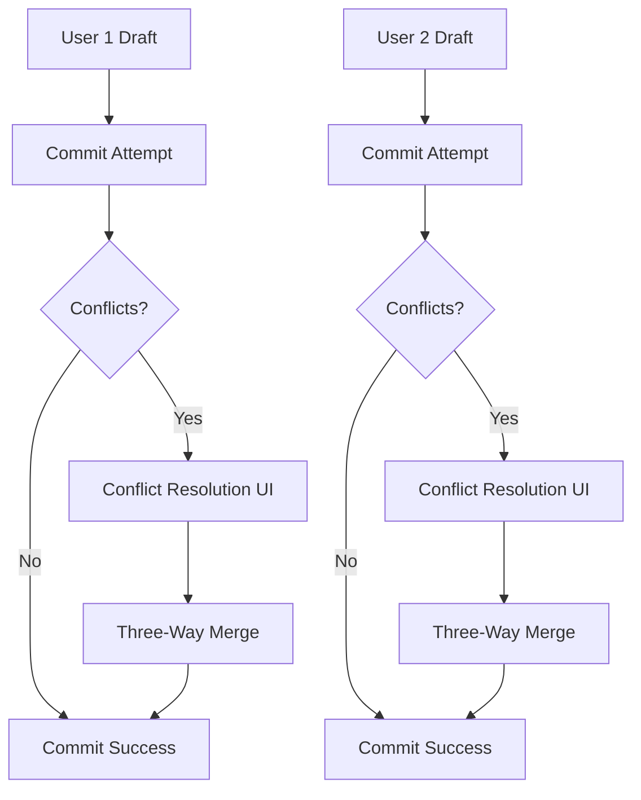

**Conflict Detection Algorithm** (Git-style three-way merge):
1. **Base**: Last committed state
2. **Theirs**: Latest commit in repository
3. **Ours**: User's draft state
4. **Conflict**: Same artifact modified in both "theirs" and "ours"

**Merge Strategies**:
- **Accept Theirs**: Discard local changes, use repository version
- **Accept Ours**: Keep local changes, overwrite repository version
- **Manual Merge**: User resolves conflicts field-by-field

**Draft State Management**:
- Per-user draft stored in browser (localStorage/IndexedDB)
- Auto-save on every keystroke (debounced 300-500ms)
- Periodic sync to server for backup
- Recovery on page reload

#### Real-Time Collaboration (Future)

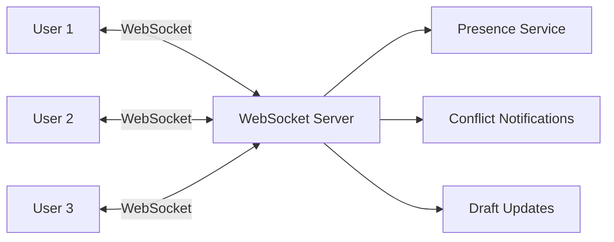

**Features**:
- Real-time presence indicators
- Live conflict notifications
- Draft state synchronization
- Collaborative editing awareness

### 9.3 Future Scalability

**Potential Enhancements**:
- **Database Layer**: Add PostgreSQL/SQLite for faster queries
- **Caching**: Redis for frequently accessed data
- **Load Balancing**: Multiple API instances behind load balancer
- **WebSockets**: Real-time updates for collaboration (PLANNED)
- **Object Storage**: S3-compatible storage for large projects
- **Microservices**: Separate AI, export, and import services

---

## 10. Design Decisions

### 10.1 Why Git + XML?

**Decision**: Use Git repositories with XML files instead of traditional database

**Rationale**:
- ✅ **Full History**: Every change tracked automatically
- ✅ **Human Readable**: XML files can be inspected and edited
- ✅ **Branching**: Support for parallel development (future)
- ✅ **Distributed**: Each project is self-contained
- ✅ **Tooling**: Leverage existing Git tools (diff, merge, blame)
- ⚠️ **Performance**: May be slower for very large projects (acceptable trade-off)

### 10.2 Why FastAPI?

**Decision**: Use FastAPI instead of Flask or Django

**Rationale**:
- ✅ **Performance**: ASGI-based, async support
- ✅ **Type Safety**: Pydantic integration
- ✅ **Documentation**: Automatic OpenAPI/Swagger docs
- ✅ **Modern**: Built for Python 3.7+
- ✅ **Developer Experience**: Excellent error messages

### 10.3 Why React?

**Decision**: Use React instead of Vue, Angular, or Svelte

**Rationale**:
- ✅ **Ecosystem**: Largest component library ecosystem
- ✅ **Maturity**: Battle-tested, stable
- ✅ **Talent Pool**: Widely known framework
- ✅ **Performance**: Virtual DOM, React 19 improvements
- ✅ **Tooling**: Excellent dev tools and build systems

### 10.4 Why Dual Deployment?

**Decision**: Support both web (ASIG) and desktop (PyWebView) deployments

**Rationale**:
- ✅ **Flexibility**: Users choose deployment model
- ✅ **Accessibility**: Web for teams, desktop for individuals
- ✅ **Offline**: Desktop works without network
- ✅ **Security**: Desktop keeps data local
- ✅ **Same Codebase**: Minimal duplication

---

## 11. Future Architecture Evolution

### 11.1 Planned Enhancements

1. **Database Layer**: Optional PostgreSQL backend for performance
2. **Real-time Collaboration**: WebSocket support for multi-user editing
3. **Microservices**: Split AI, reporting, and import/export into separate services
4. **Event Sourcing**: Track all state changes as events
5. **GraphQL API**: Alternative to REST for complex queries

### 11.2 Migration Path

The architecture is designed to evolve incrementally:

1. **Phase 1** (Current): File-based, basic single-user
2. **Phase 2** (In Progress): Multi-user with conflict resolution, OAuth, auto-save
3. **Phase 3** (Planned): AI orchestrator with worker agents and background tasks
4. **Phase 4** (Planned): Export system with templates and repeatable scripts
5. **Phase 5** (Future): Real-time collaboration with WebSockets
6. **Phase 6** (Future): Database caching layer for performance
7. **Phase 7** (Future): Microservices architecture for enterprise scale

### 11.3 Technology Roadmap

**Phase 2 Additions**:
- WebSockets (FastAPI WebSockets)
- Redis (caching and session storage)
- Authlib (OAuth integration)

**Phase 3 Additions**:
- Celery or RQ (task queue)
- Qdrant or Chroma (vector database)
- Enhanced Strands Agents integration

**Phase 4 Additions**:
- Jinja2 (template engine)
- WeasyPrint or ReportLab (PDF generation)
- pandas (data export)

**Phase 5+ Additions**:
- PostgreSQL (relational database)
- GraphQL (alternative API)
- Kubernetes (container orchestration)

---

## 12. References

- [FastAPI Documentation](https://fastapi.tiangolo.com/)
- [React Documentation](https://react.dev/)
- [GitPython Documentation](https://gitpython.readthedocs.io/)
- [Pydantic Documentation](https://docs.pydantic.dev/)
- [REST API Design Best Practices](https://restfulapi.net/)
- [Strands Agents Documentation](https://github.com/google/strands)
- [Celery Documentation](https://docs.celeryq.dev/)
- [Redis Documentation](https://redis.io/documentation)
- [Qdrant Documentation](https://qdrant.tech/documentation/)
- [Chroma Documentation](https://docs.trychroma.com/)
- [Sentence Transformers Documentation](https://www.sbert.net/)
- [Tree-sitter Documentation](https://tree-sitter.github.io/tree-sitter/)
- [Jinja2 Documentation](https://jinja.palletsprojects.com/)
- [WeasyPrint Documentation](https://weasyprint.org/)
- [Authlib Documentation](https://docs.authlib.org/)
- [RAG Best Practices](https://www.pinecone.io/learn/retrieval-augmented-generation/)
