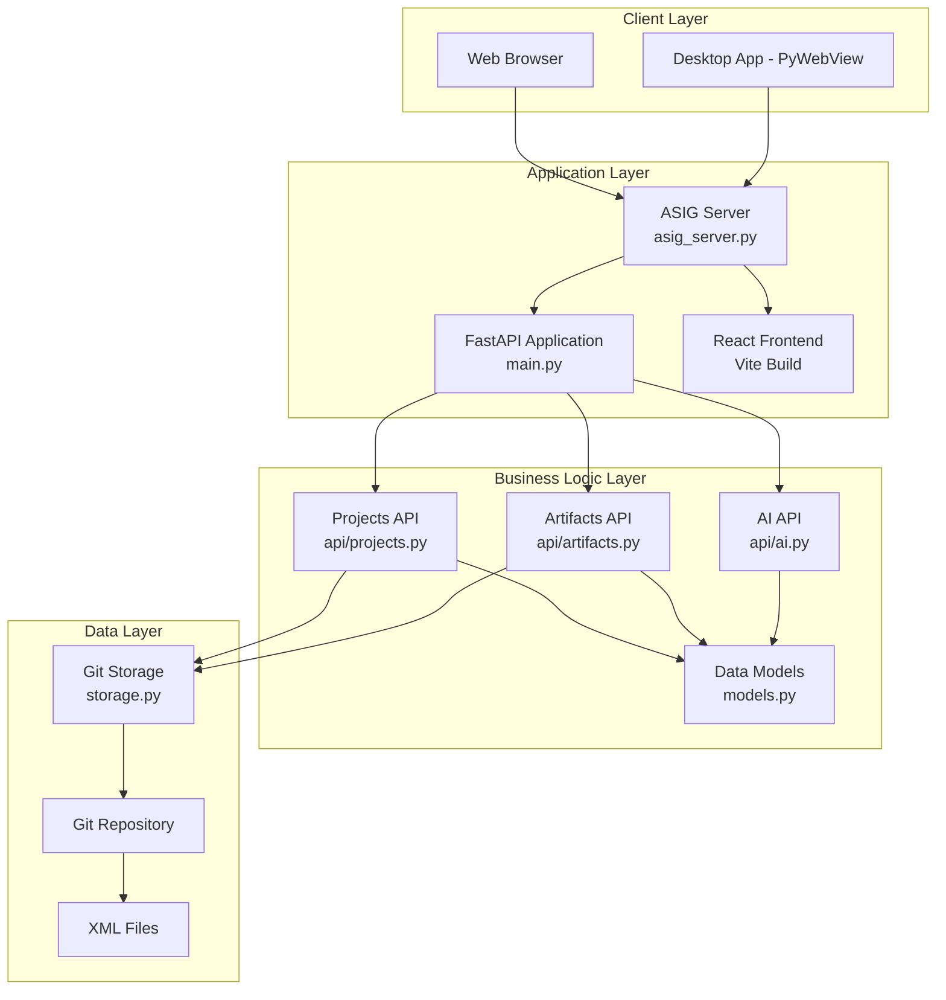
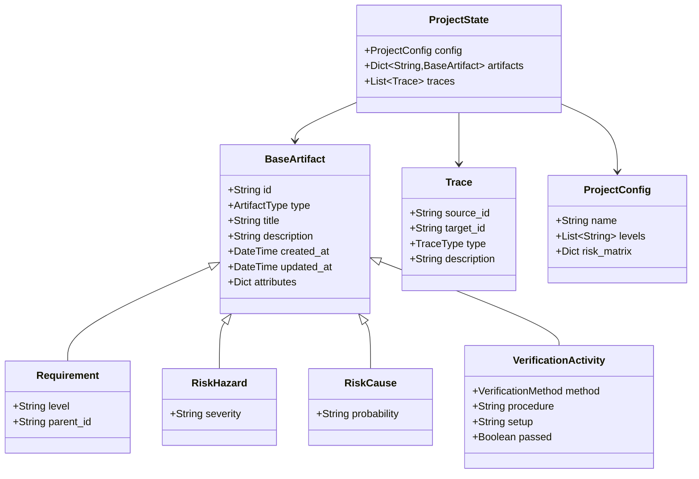

# SEALMit - Engineering Lifecycle Management System

## Project Overview

**SEALMit** is a comprehensive Engineering Lifecycle Management (ELM) application designed to provide flexible infrastructure and tooling for managing engineering projects. The system supports multi-level requirements with full traceability, integrated risk management, diverse verification activities, and transactional revision-controlled data changes.

### Key Features

- **Multi-level Requirements Management**: Hierarchical requirements with parent-child relationships and configurable levels (User, System, Performance, etc.)
- **Risk Management**: Comprehensive risk tracking with hazards, causes, severity, and probability assessments
- **Verification Activities**: Support for diverse verification methods (Test, Analysis, Review) with detailed procedures and results
- **Full Traceability**: Trace relationships between artifacts (satisfies, verifies, mitigates, causes)
- **Git-based Version Control**: All project data stored in XML format with full Git revision history
- **Multi-User Collaboration**: Conflict detection, resolution, and draft management
- **RAG Knowledge Base**: AI-powered source code analysis and troubleshooting
- **Advanced Export**: Template-based export to PDF, CSV, and more
- **AI Assistant**: Integrated AI assistant for project guidance and support (using Strands Agents)
- **Dual Deployment**: Can be deployed as both an ASIG web application and a standalone desktop application
- **Clean Web Interface**: Fast, intuitive React-based user interface

---

## Technology Stack

### Backend

| Technology | Version | Purpose |
|------------|---------|---------|
| **Python** | ≥3.11 | Primary backend language |
| **FastAPI** | ≥0.122.0 | Web framework and API server |
| **Pydantic** | ≥2.12.5 | Data validation and models |
| **GitPython** | ≥3.1.45 | Git repository management |
| **Uvicorn** | ≥0.38.0 | ASGI server |
| **PyWebView** | ≥6.1 | Desktop application wrapper |
| **Strands Agents** | ≥1.18.0 | AI assistant integration |
| **uv** | - | Python package manager |
| **Ruff** | - | Linter and formatter |
| **MyPy** | - | Static type checking |

### Planned Backend Additions

| Technology | Purpose |
|------------|---------|
| **Qdrant** or **Chroma** | Vector database for RAG |
| **Celery** or **RQ** | Background task queue |
| **Authlib** | OAuth authentication |
| **Jinja2** | Template engine for exports |
| **WeasyPrint** | PDF generation |

### Frontend

| Technology | Version | Purpose |
|------------|---------|---------|
| **React** | ^19.2.0 | UI framework |
| **React Router** | ^7.9.6 | Client-side routing |
| **Vite** | ^7.2.4 | Build tool and dev server |
| **ESLint** | ^9.39.1 | Code linting |

### Storage

- **Format**: XML files for all project data
- **Version Control**: Git repository per project
- **Structure**: 
  - `project.xml` - Project configuration
  - `traces.xml` - Traceability links
  - `artifacts/*.xml` - Individual artifact files

---

## Architecture

### System Architecture



### Data Model



### Trace Types

| Trace Type | Description |
|------------|-------------|
| **SATISFIES** | A design/implementation satisfies a requirement |
| **VERIFIES** | A verification activity verifies a requirement/design |
| **MITIGATES** | A control mitigates a risk |
| **CAUSES** | A cause leads to a hazard |

### Artifact Types

| Artifact Type | Description | Key Fields |
|---------------|-------------|------------|
| **REQUIREMENT** | System requirement at any level | level, parent_id |
| **RISK_HAZARD** | Identified hazard or risk | severity |
| **RISK_CAUSE** | Cause of a risk/hazard | probability |
| **VERIFICATION_ACTIVITY** | Test, analysis, or review | method, procedure, setup, passed |

---

## Project Structure

```
sealmit/
├── backend/                    # Python backend application
│   ├── api/                   # API route modules
│   │   ├── __init__.py
│   │   ├── projects.py        # Project management endpoints
│   │   ├── artifacts.py       # Artifact CRUD endpoints
│   │   └── ai.py              # AI assistant endpoints
│   ├── main.py                # Main FastAPI application
│   ├── asig_server.py         # ASIG web server (serves frontend + API)
│   ├── desktop_app.py         # Desktop application launcher
│   ├── models.py              # Pydantic data models
│   ├── storage.py             # Git-based XML storage layer
│   ├── pyproject.toml         # Python dependencies
│   └── README.md
├── frontend/                   # React frontend application
│   ├── src/
│   │   ├── components/        # React components
│   │   │   ├── Layout.jsx     # Main layout with header
│   │   │   └── Assistant.jsx  # AI assistant chat interface
│   │   ├── pages/             # Page components
│   │   │   ├── ProjectList.jsx
│   │   │   ├── ProjectDashboard.jsx
│   │   │   ├── RequirementsView.jsx
│   │   │   ├── RiskView.jsx
│   │   │   └── VerificationView.jsx
│   │   ├── App.jsx            # Main app component with routing
│   │   └── main.jsx           # Entry point
│   ├── public/                # Static assets
│   ├── dist/                  # Build output
│   ├── package.json           # Node dependencies
│   ├── vite.config.js         # Vite configuration
│   └── README.md
├── projects_data/             # Storage for project repositories
│   └── [project_name]/        # Individual project directories
│       ├── .git/              # Git repository
│       ├── project.xml        # Project configuration
│       ├── traces.xml         # Traceability links
│       ├── artifacts/         # Artifact XML files
│       │   └── [uuid].xml
│       └── README.md
├── verify_ai.py               # AI integration verification script
├── verify_asig.py             # ASIG server verification script
└── verify_backend.py          # Backend API verification script
```

---

## API Documentation

### Base URL

- **Development**: `http://localhost:8000`
- **ASIG Server**: `http://localhost:8080`

### Projects API (`/api/projects`)

#### List Projects
```http
GET /api/projects/
```
**Response**: `List[String]` - Array of project names

#### Create Project
```http
POST /api/projects/
Content-Type: application/json

{
  "name": "My Project",
  "levels": ["User", "System", "Performance"],
  "risk_matrix": {}
}
```
**Response**: `ProjectConfig` - Created project configuration

#### Get Project
```http
GET /api/projects/{name}
```
**Response**: `ProjectState` - Complete project state including config, artifacts, and traces

### Artifacts API (`/api/artifacts`)

#### Create Artifact
```http
POST /api/artifacts/{project_name}/artifacts
Content-Type: application/json

{
  "type": "requirement",
  "title": "User shall be able to login",
  "description": "Detailed description",
  "level": "User",
  "parent_id": null
}
```
**Response**: `BaseArtifact` - Created artifact

#### Update Artifact
```http
PUT /api/artifacts/{project_name}/artifacts/{artifact_id}
Content-Type: application/json

{
  "id": "artifact-uuid",
  "type": "requirement",
  "title": "Updated title",
  ...
}
```
**Response**: `BaseArtifact` - Updated artifact

#### Delete Artifact
```http
DELETE /api/artifacts/{project_name}/artifacts/{artifact_id}
```
**Response**: `{"status": "success"}`

#### Create Trace
```http
POST /api/artifacts/{project_name}/traces
Content-Type: application/json

{
  "source_id": "artifact-uuid-1",
  "target_id": "artifact-uuid-2",
  "type": "satisfies",
  "description": "Optional description"
}
```
**Response**: `Trace` - Created trace

#### Commit Changes
```http
POST /api/artifacts/{project_name}/commit
Content-Type: application/json

{
  "message": "Added new requirements"
}
```
**Response**: `{"status": "committed"}`

### AI API (`/api/ai`)

#### Chat with AI Assistant
```http
POST /api/ai/chat
Content-Type: application/json

{
  "message": "How do I create a requirement?",
  "history": [
    {"role": "user", "content": "Previous message"},
    {"role": "assistant", "content": "Previous response"}
  ]
}
```
**Response**: `{"response": "AI response text"}`

> [!NOTE]
> The AI integration is currently a placeholder. Full Strands Agents integration is planned.

---

## Setup Instructions

### Prerequisites

- **Python** 3.11 or higher
- **Node.js** 18 or higher
- **uv** (Python package manager)
- **Git**

### Backend Setup

1. Navigate to the backend directory:
   ```bash
   cd backend
   ```

2. Install dependencies using uv:
   ```bash
   uv sync
   ```

3. Run the development server:
   ```bash
   # API only (port 8000)
   uv run uvicorn main:app --reload --port 8000
   
   # ASIG server with frontend (port 8080)
   uv run python asig_server.py
   
   # Desktop application
   uv run python desktop_app.py
   ```

### Frontend Setup

1. Navigate to the frontend directory:
   ```bash
   cd frontend
   ```

2. Install dependencies:
   ```bash
   npm install
   ```

3. Run the development server:
   ```bash
   npm run dev
   ```
   The frontend will be available at `http://localhost:5173`

4. Build for production:
   ```bash
   npm run build
   ```
   Output will be in the `dist/` directory

### Verification Scripts

Run verification scripts from the project root:

```bash
# Verify backend API
python verify_backend.py

# Verify ASIG server
python verify_asig.py

# Verify AI integration
python verify_ai.py
```

---

## Development Workflows

### Creating a New Project

1. **Via API**:
   ```bash
   curl -X POST http://localhost:8000/api/projects/ \
     -H "Content-Type: application/json" \
     -d '{"name": "MyProject", "levels": ["User", "System"]}'
   ```

2. **Via UI**: Navigate to the project list and click "Create Project"

### Adding Requirements

1. Create a requirement artifact via API:
   ```bash
   curl -X POST http://localhost:8000/api/artifacts/MyProject/artifacts \
     -H "Content-Type: application/json" \
     -d '{
       "type": "requirement",
       "title": "System shall respond within 2 seconds",
       "level": "Performance"
     }'
   ```

2. The requirement is saved as a draft in XML format

3. Commit changes:
   ```bash
   curl -X POST http://localhost:8000/api/artifacts/MyProject/commit \
     -H "Content-Type: application/json" \
     -d '{"message": "Added performance requirement"}'
   ```

### Creating Traceability Links

1. Create artifacts (e.g., a requirement and a verification activity)
2. Create a trace linking them:
   ```bash
   curl -X POST http://localhost:8000/api/artifacts/MyProject/traces \
     -H "Content-Type: application/json" \
     -d '{
       "source_id": "verification-uuid",
       "target_id": "requirement-uuid",
       "type": "verifies"
     }'
   ```

### Version Control Workflow

All changes are tracked in Git:

1. **Draft Changes**: Modifications are saved to XML files but not committed
2. **Commit**: Use the commit endpoint to create a Git commit
3. **History**: View Git history to see all changes
4. **Rollback**: Checkout previous commits to restore earlier states

### Deployment Options

#### ASIG Web Application

1. Build the frontend:
   ```bash
   cd frontend
   npm run build
   ```

2. Run the ASIG server:
   ```bash
   cd backend
   uv run python asig_server.py
   ```

3. Access at `http://localhost:8080`

#### Standalone Desktop Application

1. Build the frontend (same as above)

2. Run the desktop app:
   ```bash
   cd backend
   uv run python desktop_app.py
   ```

3. A native window will open with the application

---

## Data Storage Details

### XML Schema

#### Project Configuration (`project.xml`)
```xml
<?xml version="1.0" encoding="utf-8"?>
<ProjectConfig>
  <Name>My Project</Name>
  <Levels>
    <Level>User</Level>
    <Level>System</Level>
    <Level>Performance</Level>
  </Levels>
</ProjectConfig>
```

#### Traces (`traces.xml`)
```xml
<?xml version="1.0" encoding="utf-8"?>
<Traces>
  <Trace>
    <SourceID>uuid-1</SourceID>
    <TargetID>uuid-2</TargetID>
    <Type>satisfies</Type>
    <Description>Optional description</Description>
  </Trace>
</Traces>
```

#### Artifact (`artifacts/[uuid].xml`)
```xml
<?xml version="1.0" encoding="utf-8"?>
<Artifact>
  <ID>uuid</ID>
  <Type>requirement</Type>
  <Title>System shall respond within 2 seconds</Title>
  <Description>Detailed description</Description>
  <Level>Performance</Level>
  <ParentID>parent-uuid</ParentID>
</Artifact>
```

### Git Repository Structure

Each project is a separate Git repository:

```
projects_data/MyProject/
├── .git/                      # Git repository
├── project.xml                # Project configuration
├── traces.xml                 # Traceability links
├── artifacts/                 # Artifact storage
│   ├── uuid-1.xml
│   ├── uuid-2.xml
│   └── ...
└── README.md                  # Auto-generated
```

### Storage Layer (`storage.py`)

The `GitStorage` class provides:

- **Initialization**: Creates Git repo if needed
- **Save Draft**: Writes XML files without committing
- **Load Project**: Reads XML files and reconstructs `ProjectState`
- **Commit**: Creates Git commit with message
- **History**: Retrieves Git commit history
- **Checkout**: Restores previous project state

---

## Frontend Components

### Layout Structure

```
App (Router)
└── Layout
    ├── Header
    │   └── Logo (Link to /)
    ├── Main Content (Outlet)
    │   ├── ProjectList (/)
    │   └── ProjectDashboard (/project/:projectName/*)
    │       ├── RequirementsView
    │       ├── RiskView
    │       └── VerificationView
    └── Assistant (AI Chat)
```

### Component Descriptions

| Component | Purpose | Key Features |
|-----------|---------|--------------|
| **Layout** | Main application shell | Header, navigation, AI assistant |
| **ProjectList** | List all projects | Create new projects, navigate to dashboards |
| **ProjectDashboard** | Project overview | Tabs for requirements, risks, verification |
| **RequirementsView** | Requirements management | Hierarchical view, create/edit requirements |
| **RiskView** | Risk management | Hazards, causes, risk matrix |
| **VerificationView** | Verification activities | Test procedures, results tracking |
| **Assistant** | AI chat interface | Context-aware help, project guidance |

### Routing

| Route | Component | Description |
|-------|-----------|-------------|
| `/` | ProjectList | Home page with project list |
| `/project/:projectName/*` | ProjectDashboard | Project-specific views |

---

## AI Integration

### Current Status

The AI integration uses **Strands Agents** (≥1.18.0) but is currently implemented as a placeholder.

### Planned Features

- **Context-Aware Assistance**: AI has access to project data, artifacts, and traces
- **Natural Language Queries**: Ask questions about requirements, risks, verification status
- **Guided Workflows**: Step-by-step assistance for common tasks
- **Automated Analysis**: Traceability gap detection, risk assessment suggestions
- **Documentation Generation**: Auto-generate reports and documentation

### API Endpoint

```http
POST /api/ai/chat
```

The AI assistant is accessible via the floating chat interface in the bottom-right corner of the UI.

---

## Code Quality Tools

### Backend

- **uv**: Fast Python package manager and environment manager
- **Ruff**: Extremely fast Python linter and formatter
- **MyPy**: Static type checking for Python

### Frontend

- **ESLint**: JavaScript/React linting
- **React Hooks Linting**: Ensures proper hook usage
- **React Refresh**: Fast refresh during development

---

## Future Enhancements

### Planned Features

1. **Multi-User Collaboration**: Conflict resolution, auto-save, draft management
2. **AI Orchestrator & RAG**: Source code knowledge base, worker agents, code-aware assistance
3. **Export System**: Templates, PDF/CSV/Excel export, repeatable scripts
4. **User Management**: OAuth integration, session management, RBAC
5. **Advanced Traceability**: Transitive traces, partial verification, impact analysis
6. **Real-time Collaboration**: WebSocket-based live updates

### Technical Debt

- Complete AI assistant implementation with Strands Agents
- Add comprehensive test coverage (unit, integration, E2E)
- Implement user authentication and authorization
- Add database caching layer for performance
- Implement real-time updates via WebSockets
- Add comprehensive error handling and logging

---

## Troubleshooting

### Common Issues

#### Frontend not building
```bash
# Clear cache and reinstall
cd frontend
rm -rf node_modules package-lock.json
npm install
npm run build
```

#### Backend not starting
```bash
# Reinstall dependencies
cd backend
uv sync --reinstall
```

#### CORS errors
- Ensure frontend dev server is running on port 5173
- Check CORS configuration in `main.py`

#### Git repository issues
- Each project should have its own `.git` directory
- Check file permissions in `projects_data/`

---

## Contributing

### Development Guidelines

1. **Code Style**: Follow PEP 8 for Python, ESLint rules for JavaScript
2. **Type Hints**: Use type hints for all Python functions
3. **Documentation**: Document all public APIs and complex logic
4. **Testing**: Write tests for new features
5. **Commits**: Use descriptive commit messages

### Project Contacts

- **Project Name**: SEALMit
- **Type**: Engineering Lifecycle Management System
- **Status**: Active Development

---

## License

*License information to be added*

---

## Appendix

### Glossary

- **ELM**: Engineering Lifecycle Management
- **ASIG**: Application Server Integration Gateway (web deployment mode)
- **Artifact**: Any managed item (requirement, risk, verification activity)
- **Trace**: Relationship between two artifacts
- **Draft**: Unsaved changes in XML files
- **Commit**: Git commit of project state

### References

- [FastAPI Documentation](https://fastapi.tiangolo.com/)
- [React Documentation](https://react.dev/)
- [Vite Documentation](https://vite.dev/)
- [GitPython Documentation](https://gitpython.readthedocs.io/)
- [Pydantic Documentation](https://docs.pydantic.dev/)
